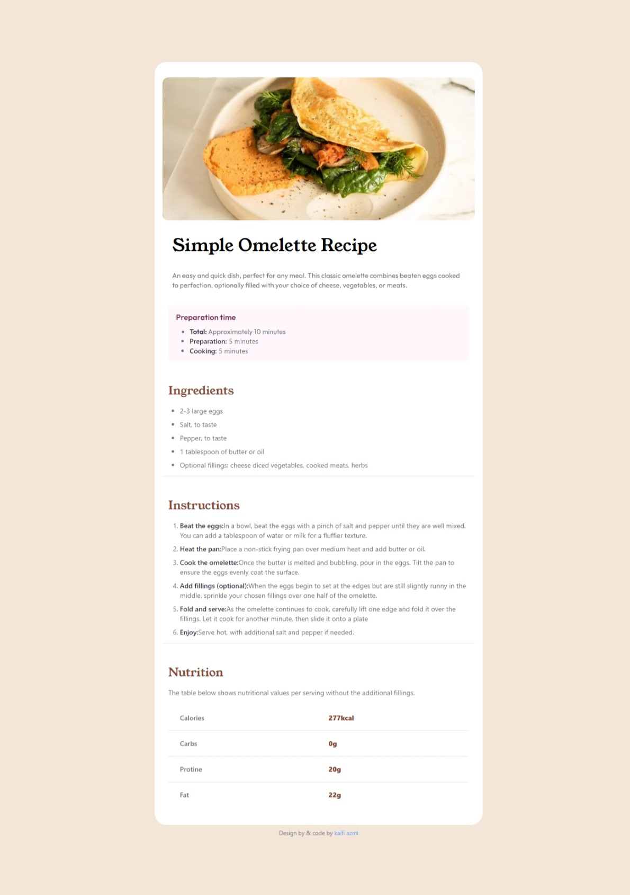

# Frontend Mentor - Recipe page solution

This is a solution to the [Recipe page challenge on Frontend Mentor](https://www.frontendmentor.io/challenges/recipe-page-KiTsR8QQKm). Frontend Mentor challenges help you improve your coding skills by building realistic projects. 

## Table of contents

- [Screenshot](#screenshot)
- [Links](#links)
- [Built with](#built-with)
- [What I learned](#what-i-learned)

## Screenshot

## Links

- Live Site URL: [ui-recipe-challenge](https://ui-recipe-challenge.netlify.app)

## Built with

- [React](https://reactjs.org/) - JS library
- [Next.js](https://nextjs.org/) - React framework
- [Tailwind](https://tailwindcss.com/) - For styles

## What I learned

While the overall experience was positive, there were some challenges.It's worth mentioning that the initial learning curve for Tailwind CSS might be steep for developers accustomed to traditional CSS frameworks.
Creating a webpage with Next.js, Tailwind CSS, and TypeScript was a rewarding experience. The seamless integration of these technologies, coupled with the performance benefits and a supportive community, make this stack an excellent choice for modern web development projects. Whether you are a seasoned developer or a newcomer, exploring this stack is a worthwhile investment in enhancing your web development skills.

